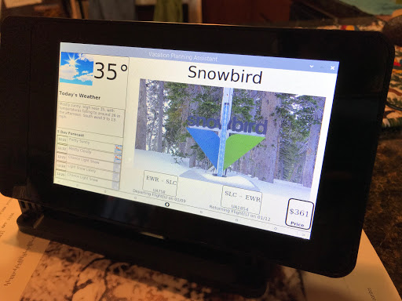

# Skiing Vacation Planner

An IOT assistant that will help with planning your next ski trip!  

I created this to work with a Raspberry Pi 3B+ with the official 7" touchscreen.  There were many challenges to overcome, 
which I will outline in the lessons learned section of this document.

### Background

My girlfriends' parents enjoy skiing, and have several favorite ski resorts throughout the US.  I wanted to make something
that would show them the current conditions at glance of their favorite resorts, as well as what traveling there would 
look like.  I wanted it to be present in their home with minimal configuration.

### Description

Ski resort information is defined in a configuration file.  Information about the users' home is then put into a secrets
so that travel information can be calculated.  When all setup is complete, the planner runs on a Raspberry Pi and will
automatically update with recent info about the ski resorts defined in the configuration file.

## Setup

This walkthrough will demonstrate how I created my implementation of the project.  The software will run on Windows/MacOSX/Linux
and can be run with simply cloning this repository, installing the required packages, and running the main program.  However, 
in order to create the IOT device, continue reading below.

#### Necessary Materials

1. Raspberry Pi 3B+
2. Raspberry Pi Touchscreen
2.a. (optionally) Raspberry Pi Touchscreen Case
3. Raspberry Pi Power Supply
4. MicroSD card >8gb

#### Raspberry Pi Setup

Set up the raspberry pi and the touchscreen according to the guides that ill put a link to here

#### Amadeus Setup

Get amadeus Keys

#### Google Maps Setup

Get Google Maps Keys

## Initialization on the Pi

After completing the raspberry pi setup and setting up Raspbian on your Pi install the necessary packages.

#### Secrets Config

Copy `secrets.yaml.example` into a new file in the root directory called `secrets.yaml` and add your api keys.

